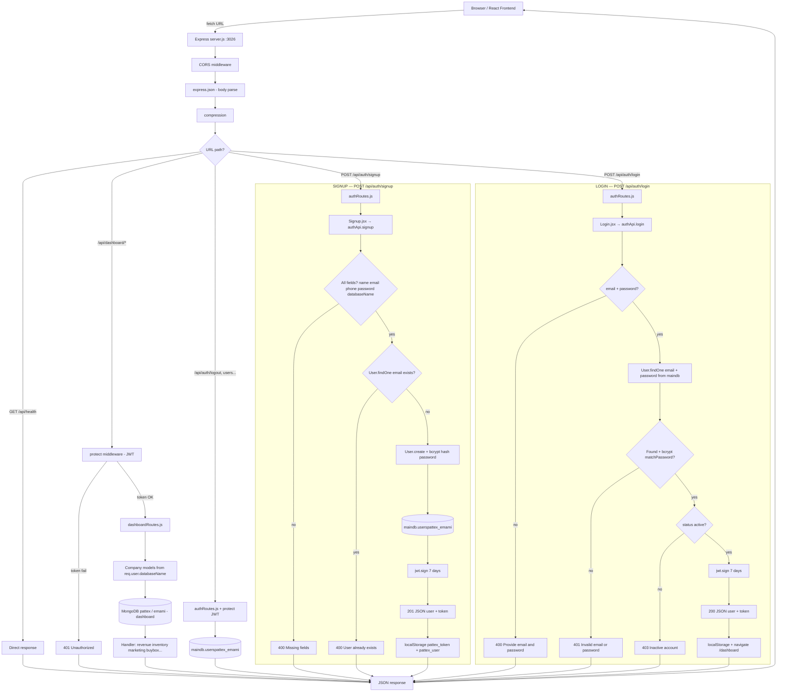
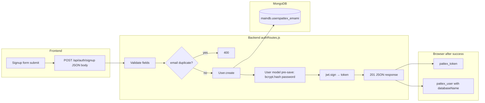
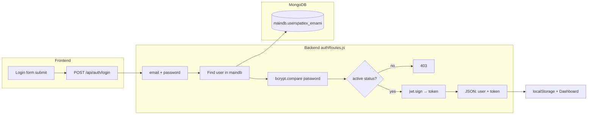
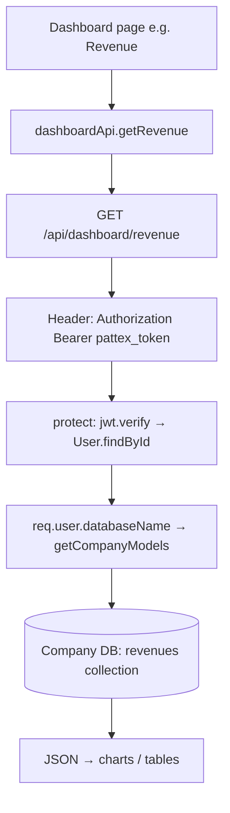

# Pattex Backend — API flow (with Signup & Login)

Server: `http://localhost:3026` · Base API: `/api`

**Draw.io:** Haan, is diagram ko draw.io par khol/edit kar sakte ho. Steps → [`drawio-import-guide.md`](./drawio-import-guide.md). Copy-paste file → [`backend-api-flow.mmd`](./backend-api-flow.mmd).

---

## 1. Main request flow (updated — Signup & Login included)

Same structure as your diagram; `/api/auth` paths now show full signup/login steps.

---

## 2. Signup only (detail)

**Signup body:** `{ name, email, phone, password, databaseName, role? }`  
**`databaseName`** = which company dashboard DB to use later (e.g. `pattex`, `emami`).

---

## 3. Login only (detail)

---

## 4. Dashboard API after login

---

## Quick reference

| Step | Signup | Login |
|------|--------|-------|
| URL | `POST /api/auth/signup` | `POST /api/auth/login` |
| DB read/write | Write new user in **maindb** | Read user from **maindb** |
| Password | Hash on save (bcrypt) | Compare with hash (bcrypt) |
| Token | JWT 7 days | JWT 7 days |
| Frontend storage | `pattex_token`, `pattex_user` | Same |

Protected routes always send: `Authorization: Bearer <token>`.
